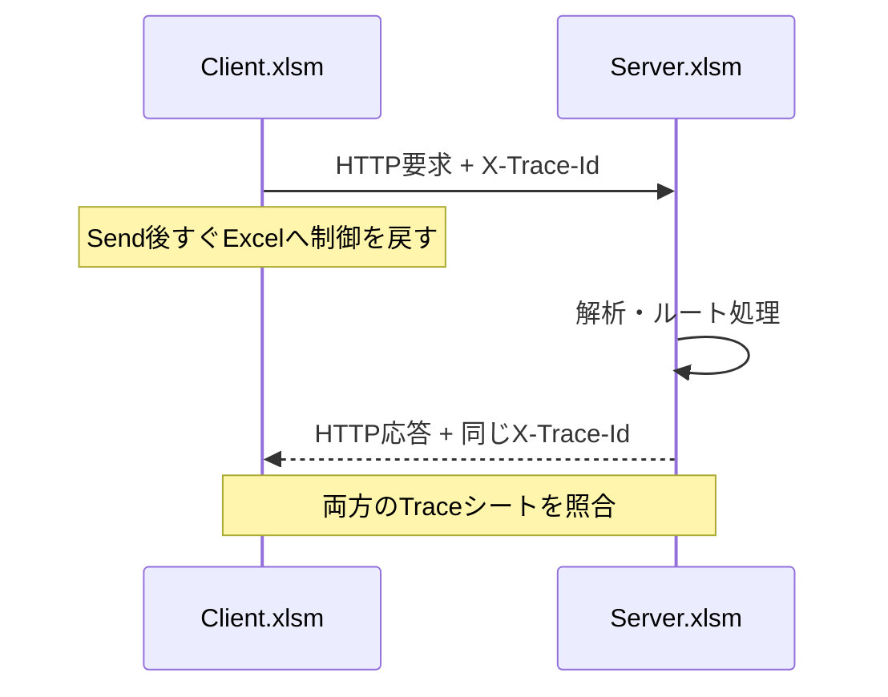

# VBA Async HTTP API Sample

Excel VBAだけで、**非同期HTTPクライアントとローカル簡易HTTPサーバーを動かし、通信の両側をTraceIdで追跡する学習用サンプル**です。

外部のPowerShell、`curl`、Webサービス、APIキーは使いません。クライアントとサーバーを自分のPC内で動かすため、HTTPの要求・応答、非同期イベント、エラー処理を段階的に観察できます。

> 対象: Windows版Excel / VBA7（32ビット版・64ビット版Office）  
> 用途: 初学者、学生、社内研修、VBAからREST APIを呼び出す前の基礎学習  
> 注意: このサーバーは教材です。業務用・公開用Webサーバーとしては使用できません。

## 何を学べるか

- 同期通信と非同期通信の違い
- `MSXML2.XMLHTTP60`の`readyState`とイベント駆動
- HTTPのリクエスト行、ヘッダー、本文、ステータスコード
- TCPの`socket`、`bind`、`listen`、`accept`、`recv`、`send`
- VBAのUnicode文字列とHTTPのUTF-8バイト列の違い
- `Content-Length`が「文字数」ではなく「バイト数」である理由
- クライアントとサーバーを同じTraceIdで追跡する方法
- HTTP 500、接続失敗、遅延、キャンセルの観察
- 秘密情報をトレースへ残さない設計の考え方

## 全体像



推奨構成は、**1冊のマクロブックへ全5モジュールを取り込み、マクロから同じブックを別Excelプロセスで読み取り専用として開く**方法です。

| Excelプロセス | ブック | 役割 |
|---|---|---|
| 元のExcel | `VBA_Async_HTTP_API_Sample.xlsm` | 非同期クライアントを実行 |
| 自動起動したExcel | 同じブックの読み取り専用コピー | `127.0.0.1:18080`で簡易HTTPサーバーを実行 |

`/delay?ms=3000`を使うと、サーバー側が約3秒待機している間もクライアント側Excelを操作できます。これが非同期通信を体験する最も分かりやすいサンプルです。

## ファイル構成

```text
VBA_Async_HTTP_API_Sample/
├─ README.md
├─ SECURITY.md
├─ src/
│  ├─ CAsyncHttpClient.cls  非同期HTTPクライアント
│  ├─ modClientDemo.bas     クライアント用の実行マクロ
│  ├─ modHttpServer.bas     Winsock簡易HTTPサーバー
│  ├─ modTrace.bas          Traceシートへの共通記録
│  └─ modUtf8.bas           Unicode／UTF-8変換
└─ docs/
   ├─ TESTING.md            テスト手順と期待結果
   └─ REVIEW.md             疑似ペルソナ100回の静的レビュー記録
```

## すぐに試す手順

### 1. 1冊のマクロブックを作る

1. Windows版Excelを起動します。
2. 新しいブックを`VBA_Async_HTTP_API_Sample.xlsm`として保存します。
3. `Alt`+`F11`でVBE（Visual Basic Editor）を開きます。
4. `ツール`→`参照設定`で、**Microsoft XML, v6.0**にチェックを付けます。
5. `ファイル`→`ファイルのインポート`で、次の5ファイルをすべて読み込みます。
   - `src/modTrace.bas`
   - `src/modUtf8.bas`
   - `src/modHttpServer.bas`
   - `src/CAsyncHttpClient.cls`
   - `src/modClientDemo.bas`
6. `デバッグ`→`VBAProjectのコンパイル`を実行します。
7. ブックを保存します。

### 2. サーバー用Excelを自動起動する

元のブックで`Server_StartInNewExcel`を実行します。

このマクロは次を自動で行います。

1. `CreateObject("Excel.Application")`で別Excelプロセスを作る。
2. 保存済みの同じ`.xlsm`を読み取り専用で開く。
3. サーバー側のTraceシートを初期化する。
4. サーバー側コピーで`Server_Start`を実行する。

Shell、PowerShell、`curl`は使いません。別のExcelウィンドウが開き、そのTraceシートに`LISTEN / READY`が表示されれば起動完了です。

マクロを許可できない場所から開いた場合や、組織ポリシーで自動化されたブックのマクロが禁止されている場合は起動できません。セキュリティ設定を回避せず、信頼できる場所と組織の規則を確認してください。

### 3. 元のブックからクライアントを実行する

元のExcelへ戻り、`Client_Hello`を実行します。元ブックのTraceシートで`READY_STATE`と`HTTP 200`を確認します。

サーバーは`127.0.0.1:18080`だけで待ち受けます。`127.0.0.1`はループバックアドレスで、同じPC自身を表します。

### 4. 終了する

元のブックで`Server_StopInNewExcel`を実行します。サーバーへ停止を依頼し、読み取り専用コピーを保存せず閉じ、サーバー用Excelプロセスも終了します。

`Client_ShutdownServer`はHTTPの`/shutdown`を学ぶためのマクロです。待受けは停止しますが、Traceを観察できるようサーバー用Excelウィンドウは残ります。観察後に`Server_StopInNewExcel`を実行してください。

手動で2つのブックへ分ける方法も利用できます。その場合は、サーバー用ブックへ`modTrace`、`modUtf8`、`modHttpServer`を、クライアント用ブックへ`modTrace`、`CAsyncHttpClient`、`modClientDemo`を取り込みます。

## 用意しているエンドポイント

| メソッド | URL | 学習内容 | 主な応答 |
|---|---|---|---|
| GET | `/hello` | 最小の要求・応答 | HTTP 200 + 固定JSON |
| POST | `/echo` | 本文とContent-Length | 送った本文をそのまま返す |
| GET | `/delay?ms=3000` | 非同期と待機 | 指定時間後にHTTP 200 |
| GET | `/status/500` | HTTPエラー | 意図的なHTTP 500 |
| POST | `/shutdown` | 後始末 | 応答後にサーバー停止 |

`ms`は0～10000ミリ秒に制限しています。数値でない場合は1000ミリ秒になります。

## 実行用マクロ

| マクロ | 動作 |
|---|---|
| `Client_Hello` | `/hello`を呼ぶ |
| `Client_Echo` | JSONを`/echo`へPOSTする |
| `Client_Delay3Seconds` | 3秒遅延を試す |
| `Client_Status500` | HTTP 500を観察する |
| `Client_RunBasicSequence` | 3要求を連続開始する |
| `Client_CancelAll` | 実行中の要求を中止する |
| `Client_ShutdownServer` | サーバーを遠隔停止する |
| `Server_StartInNewExcel` | 同じブックを別Excelプロセスで開き、サーバーを開始する |
| `Server_StopInNewExcel` | 自動起動したサーバーとExcelプロセスを終了する |
| `Server_Start` | 待受けを開始する |
| `Server_Stop` | 待受けとWinsockを終了する |
| `Trace_Clear` | Traceシートを初期化する |

## トレースの読み方

Traceシートには次の列を作ります。

| 列 | 意味 |
|---|---|
| 日時 | ミリ秒付きの記録時刻 |
| TraceId | 1つの要求を結び付ける識別子 |
| 側 | `CLIENT`または`SERVER` |
| 処理段階 | `SEND`、`RECEIVE`、`PARSE`など |
| 方向 | `OUT`、`IN`、`LOCAL` |
| 詳細 | URL、受信バイト数、応答本文など |
| 結果 | `OK`、`WAITING`、`HTTP 500`など |
| 経過時間(ms) | 要求開始または接続受付からの時間 |

たとえば`/echo`では、概ね次の順番になります。

```text
CLIENT  CREATE       LOCAL  POST /echo
CLIENT  READY_STATE  IN     OPENED
CLIENT  SEND         OUT    本文文字数=...
SERVER  ACCEPT       IN     クライアント接続を受付
SERVER  RECEIVE      IN     受信=...バイト
SERVER  PARSE        LOCAL  POST /echo
SERVER  RESPONSE     OUT    HTTP 200
CLIENT  READY_STATE  IN     HEADERS_RECEIVED
CLIENT  READY_STATE  IN     LOADING
CLIENT  READY_STATE  IN     DONE
CLIENT  TRACE_ID     IN     MATCH
CLIENT  RESPONSE     IN     HTTP 200の本文
CLIENT  COMPLETE     LOCAL  OK
```

クライアントの`X-Trace-Id`要求ヘッダーをサーバーが読み、同じ値を応答ヘッダーにも付けます。クライアントは応答値を照合し、`TRACE_ID / MATCH`を記録します。2冊のTraceシートをTraceIdで絞り込むと、1要求だけを追跡できます。

A～G列は文字列形式、経過時間のH列は数値形式です。値は`Value2`で書き込み、同じ内容をVBEのイミディエイトウィンドウへも`Debug.Print`で出力します。

## readyStateとは

| 値 | 名前 | 意味 |
|---:|---|---|
| 0 | UNSENT | まだ初期化されていない |
| 1 | OPENED | `Open`が完了した |
| 2 | HEADERS_RECEIVED | HTTP応答ヘッダーを受信した |
| 3 | LOADING | 応答本文を受信中 |
| 4 | DONE | 通信処理が完了した |

HTTP 500でも`readyState`は4になります。`DONE`は「HTTP処理の成功」ではなく「通信処理が完了した」という意味です。そのため、完了後に`Status`も必ず確認します。

## なぜクラスモジュールを使うのか

`XMLHTTP60`の`onreadystatechange`を受け取るには、`WithEvents`をクラスモジュール内で宣言します。

```vb
Private WithEvents m_http As MSXML2.XMLHTTP60
```

さらに、非同期要求を開始したSubが終わってもクラスが破棄されないよう、`modClientDemo`の`Collection`へ保持します。完了後はCollectionから取り除きます。

## サーバー側の処理順

```text
WSAStartup
  ↓
socket(AF_INET, SOCK_STREAM, IPPROTO_TCP)
  ↓
bind(127.0.0.1:18080)
  ↓
listen
  ↓
accept
  ↓
recv（ヘッダー末尾とContent-Lengthまで）
  ↓
HTTP解析・ルート処理
  ↓
send（全バイトを送るまで繰り返す）
  ↓
closesocket
```

待受けと受信には非ブロッキングソケットを使い、`Application.OnTime`で約1秒ごとに確認します。したがって、この教材の応答時間には最大約1～2秒程度のポーリング待ちが加わる場合があります。

## 32ビット版・64ビット版Office

- API宣言には`PtrSafe`を付けています。
- ソケットハンドルには`LongPtr`を使っています。
- バイト数、ポート番号、エラーコードには`Long`を使っています。
- Windows SDKに合わせ、`WSADATA`のフィールド順を`#If Win64 Then`で分けています。

対象はVBA7です。Office 2010以降のWindows版Excelが目安ですが、実際の利用可否はMicrosoft XML 6.0とWindows APIの提供状況にも依存します。

## 日本語コメントとファイルの文字コード

ソースはGitHub上で読みやすいUTF-8です。一方、VBEの「ファイルのインポート」は、Officeの版やWindowsの言語設定によってUTF-8の日本語コメントを正しく解釈しない場合があります。

文字化けした場合は、次のどちらかで対応してください。

1. GitHubのRaw表示からコードをコピーし、VBEの新規モジュールへ貼り付ける。
2. ソースをWindowsの日本語ANSI（CP932 / Shift_JIS）へ変換してからインポートする。

プロシージャ名や変数名はASCIIで統一しているため、コメントが文字化けしても構文への影響を抑えています。ただし日本語文字列リテラルも含むため、コンパイル前に表示を確認してください。

## 制限事項

- Windows版Excel専用です。Mac版ExcelではWinsock APIを利用できません。
- TLS（HTTPS）サーバー機能はありません。通信先はローカルのHTTPだけです。
- 1接続ずつ処理します。同時多数接続には対応しません。
- Chunked Transfer Encoding、Keep-Alive、HTTP/2には対応しません。
- 要求サイズ上限は65536バイトです。
- `/delay`はサーバー側Excelプロセスを指定時間だけ停止します。
- `Application.OnTime`のため、高精度な性能測定には使えません。
- `.xlsm`は収録していません。VBAソースを自分で取り込む教材形式です。

## トラブルシューティング

### 「ユーザー定義型は定義されていません」

`MSXML2.XMLHTTP60`の参照設定が不足しています。クライアント用ブックで**Microsoft XML, v6.0**を有効にしてください。

### bindのWinsockエラー10048

通常は、同じポートを別プロセスが使用中です。既に起動中の`Server.xlsm`がないか確認し、終了後に再実行してください。

### クライアントのStatusが0

HTTP応答を受け取る前に接続が失敗しています。サーバーが`LISTEN / READY`になっているか、URLとポートが一致しているか確認してください。

### 応答がすぐに返らない

サーバーは約1秒間隔でポーリングします。教材として処理段階を観察しやすくする構成であり、高速Webサーバーではありません。

### マクロが実行できない

ファイルを信頼できる場所へ置き、Windowsのファイルプロパティに「許可する」があれば内容を確認したうえで設定してください。出所が不明なマクロは実行しないでください。

## 検証状況

ソース構造、API宣言の32/64ビット方針、エンドポイント分岐、秘密情報のマスキング、後始末、READMEとの対応を静的に確認しています。現在の作成環境にはWindows版Excel/VBEがないため、**実機でのコンパイルと通信試験は未実施**です。

実機確認では、必ず[テスト手順](docs/TESTING.md)に沿って`VBAProjectのコンパイル`から始めてください。実機差が見つかった場合は、Officeのビット数、Excelのバージョン、Windowsのバージョン、Traceシート、エラー番号を添えて報告してください。

## セキュリティ

ローカル教材であっても、マクロとネットワーク処理には注意が必要です。[SECURITY.md](SECURITY.md)を先に確認してください。
